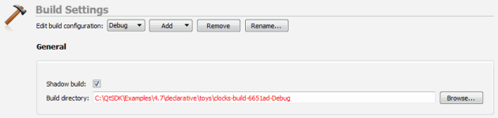
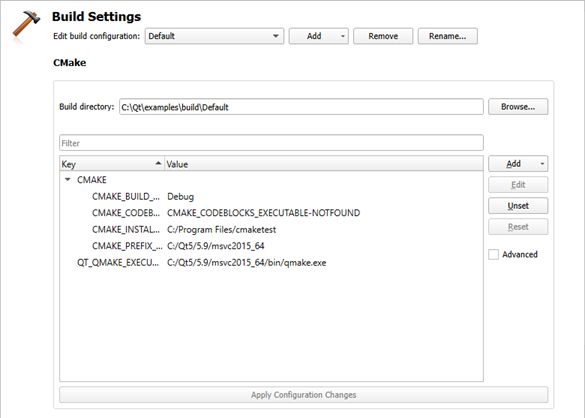
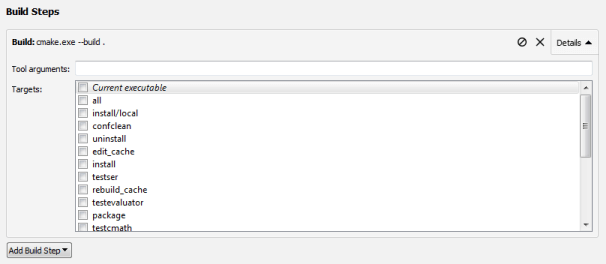
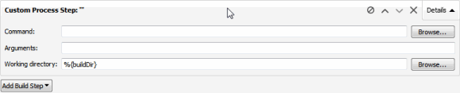
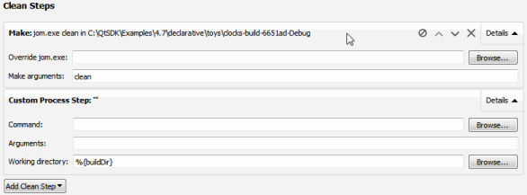
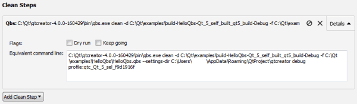
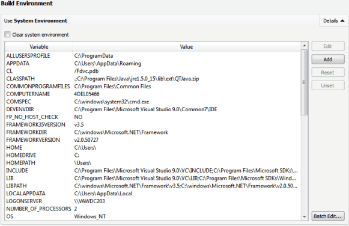

Specifying Build Settings
=========================

Different build configurations allow you to quickly switch between different build settings. By default, Qt Creator creates *debug*, *release*, and *profile* build configurations. A debug build contains additional debug symbols that you need for debugging the application but that you can leave out from the release version. Generally, you use the debug configuration for testing and the release configuration for creating the final installation file. A profile configuration is an optimized release build that is delivered with separate debug information. It is best suited for analyzing applications.

You specify build settings in the Projects mode/side-tab. To add a new build configuration, click Add and select the type of configuration you would like to add. You can add as many build configurations as you need.

To delete the build configuration currently selected, click Remove.

Editing Build Configurations
-------------------------------------------------

Select the build configuration to edit in the Edit build configuration field.

### qmake Build Configuration

By default, Qt Creator builds projects in a separate directory from the source directory, as [shadow builds](https://doc.qt.io/qtcreator/creator-glossary.html#glossary-shadow-build). This keeps the files generated for each [build and run kit](https://doc.qt.io/qtcreator/creator-glossary.html#glossary-buildandrun-kit) separate. If you only build and run with a single [kit](https://doc.qt.io/qtcreator/creator-glossary.html#glossary-buildandrun-kit), you can deselect the Shadow build checkbox.

To make in-source builds the default option for all projects, select Tools > Options > Build & Run > General, and enter a period (.) in the Default build directory field.

You can create separate versions of project files to keep platform-dependent code separate. You can use qmake [scopes](http://doc.qt.io/qt-5/qmake-tutorial.html#adding-platform-specific-source-files) to select the file to process depending on which platform qmake is run on.

### CMake Build Configuration

Setting names with a common prefix (up to the first underscore character) are grouped under the prefix. To view all settings, select the Advanced check box.

To add build settings, select Add, and then select the type of the setting that you are adding: Boolean, String, Directory, or File.

To change the type of the selected setting, select Force to bool, Force to file, Force to directory, or Force to string.

To modify the value of a build setting, double-click it, or select it, and then select Edit. To save the changes, select Apply Configuration Changes. Keep in mind that a configuration change might trigger a follow-up configuration change.

To remove a setting, select Unset.

To reset the changes that you made, select Reset.

Starting External Processes
-------------------------------------------------

Qt Creator executes external processes to accomplish tasks such as building and running applications. To execute the processes, Qt Creator uses shell commands that are native to the system. It constructs the commands from an executable name and optional command line arguments.

The executable name is specified in the executable fields: qmake, Make, Command, or Executable. It is either derived from the project or specified manually. When you specify executables manually, you can reference environment variables and Qt Creator variables. However, no quoting rules apply.

You can specify command-line arguments in the arguments fields: Additional arguments, Command arguments, Make arguments, Arguments, Default Arguments, or Extra arguments. You can create shell command lines that can contain redirection and other advanced constructs. However, some more complex use cases, such as piping test data into the application being tested or grouping commands, are not supported because the value of the Executable field is always placed first when constructing the command.

### Using Environment Variables

You can use any environment variables as values in the fields. For a list of variable names, click Build Environment > Details in the Build Settings. Environment variables are referenced using the native syntax: $VARNAME or ${VARNAME} on Unix and %VARNAME% on Windows.

### Using Qt Creator Variables

You can use Qt Creator variables in arguments, executable paths, and working directories. The variables take care of quoting their expansions, so you do not need to put them in quotes. Select the  (Variables) button in a field to select from a list of variables that are available in a particular context.

The following syntax enables you to use environment variables as Qt Creator variables: %{Env:VARNAME}.

Qt Creator uses pattern substitution when expanding variable names. To replace the first match of *pattern*within *variable* with *replacement*, use:

%{variable/pattern/replacement}

To replace all matches of *pattern* within *variable* with *replacement*, use:

%{variable//pattern/replacement}

The pattern can be a regular expression and the replacement can contain backreferences. For example, if `%{variable}` is `my123var`, then `%{variable/(..)(\d+)/\2\1}` is expanded to `123myvar`.

To use the default value if the variable is not set, use:

%{variable:-default}

Build Steps
-------------------------------------------------

In Build Steps you can change the settings for the build system selected for building the project: qmake, CMake, or Qbs.

### qmake Build Steps

Qt Creator builds qmake projects by running the `make` or `nmake` command from the Qt version defined for the current build configuration.

To override the shell command that Qt Creator constructs by default, disable or remove the build step and add a custom build step that specifies another shell command.

By default, Qt Creator uses all the CPU cores available to achieve maximum build parallelization. On Linux and macOS, you can specify the number of parallel jobs to use for building in the Parallel jobs field. Select the Override MAKEFLAGS check box to override existing MAKEFLAGS variables.

To generate debug symbols also for applications compiled in release mode, select the Generate separate debug info check box. For more information, see [Using the Performance Analyzer](https://doc.qt.io/qtcreator/creator-cpu-usage-analyzer.html#using-the-performance-analyzer).

#### Compiling QML

Since Qt 5.11, you can compile QML source code into the final binary. This improves the startup time of the application and eliminates the need to deploy QML files together with the application. For more information, see [Compiling QML Ahead of Time](http://doc.qt.io/qt-5/qtquick-deployment.html#compiling-qml-ahead-of-time).

Qt Creator new project wizards create Qt Quick projects that can be compiled, because they are set up to use the Qt Resource System. To compile Qt Quick projects, select the Enable Qt Quick Compiler check box.

Note: In earlier Qt versions, this was a commercial feature. For more information, see [Qt Quick Compiler](http://doc.qt.io/QtQuickCompiler/).

### CMake Build Steps

Qt Creator builds CMake projects by running `cmake . --build`, which then runs run whatever is needed based on how the project was configured: `make`, `mingw32-make`, `nmake`, or `ninja`, for example.

You can add arguments and targets for the build command in Build Steps.

### Qbs Build Steps

To specify build steps for Qbs:

1.  In the Build variant field, select Debug to include debug symbols in the build for debugging the application and Release to create the final installation file.
2.  In the Parallel jobs field, specify the number of parallel jobs to use for building.
3.  Select the Enable QML debugging check box to debug Qt Quick application projects.

    Note: Debugging requires opening a socket at a well-known port, which presents a security risk. Anyone on the Internet could connect to the application that you are debugging and execute any JavaScript functions. Therefore, you must make sure that the port is properly protected by a firewall.

4.  In the Properties field, specify the properties to pass to the project. Use colons (:) to separate keys from values. For more information, see [Modules](http://doc.qt.io/qbs/language-introduction.html) in the Qbs Manual.
5.  In the Flags field:
    -   Select Keep going to continue building when errors occur, if possible.
    -   Select Show command lines to print actual command lines to the compile output pane instead of high-level descriptions.
    -   Select Force probes to force re-execution of the configure scripts of [Probes](https://doc.qt.io/qbs/probe-item.html).
    -   Select Install to copy artifacts to their install location after building them. This option is enabled by default.

        Note: On Windows, the build will fail if the application is running, because the executable file cannot be overwritten. To avoid this issue, you can deselect this check box and add a Qbs Installdeployment step in the run settings that will be performed just before running the application.

    -   Select Clean install root to remove the contents of the install root directory before the build starts.
    -   Select Use default location to install the artifacts to the default location. Deselect the check box to specify another location in the Installation directory field.

The Equivalent command line field displays the build command that is constructed based on the selected options.

### Adding Custom Build Steps

To add custom steps to the build settings, select Add Build Step > Custom Process Step.

By default, custom steps are enabled. To disable a custom step, select the  (Disable) button.

### Executing Custom Commands

To execute custom commands when building for embedded devices, select Add Build Step > Custom Remote Command (via adb shell) (commercial only) and enter the command to execute.

Clean Steps
-------------------------------------------------

You can use the cleaning process to remove intermediate files. This process might help you to fix obscure issues during the process of building a project.

You can define the cleaning steps for your builds in the Clean Steps.

-   To add a clean step using make or a custom process, click Add Clean Step and select the type of step you want to add.

    By default, custom steps are enabled. To disable a custom step, select the Disable button.

-   To remove a clean step, click Remove Item.
-   To change the order of steps, click  (Move Up) and  (Move Down).

### CMake Clean Steps

When building with CMake, you can add arguments and targets for the clean command in Clean Steps.

The build errors and warnings are parsed and displayed in the Issues output pane.

### Qbs Clean Steps

When building with Qbs, you can specify flags in Clean Steps:

-   Select Dry run to test cleaning without executing commands or making permanent changes to the build graph.
-   Select Keep going to continue cleaning when errors occur, if possible.

The Equivalent command line field displays the clean command that is constructed based on the selected options.

Build Environment
-------------------------------------------------

You can specify the environment you want to use for building in the Build Environment section. By default, the environment in which Qt Creator was started is used and modified to include the Qt version. Depending on the selected Qt version, Qt Creator automatically sets the necessary environment variables. You can edit existing environment variables or add, reset and unset new variables based on your project requirements.

Note: The changes are stored in the local project specific `.pro.user` file. Therefore, they are not suitable for sharing between developers or development PCs. To share settings, incorporate them into the build system. For example, if you use qmake, make the changes in the `.pro` file.

### Batch Editing

To modify environment variable values for build or run environments, select Batch Edit in the build or run settings and enter environment variables in the Edit Environment dialog.

To remove a variable value from the environment, enter the variable name. For example, `TEST` sets the value of the `TEST` variable empty when building or running the project.

To add a variable value to the environment, enter the variable name and value, separated by the equals sign. For example, the following line prepends `/opt/bin` to the existing PATH:

`PATH=/opt/bin:${PATH}`

To add or remove several variables, place them on separate lines. The order is important. If you remove a value on a line, you cannot refer to it on the following lines. However, you can remove a value after you have referred to it on an earlier line.

### Clearing the System Environment

To build with a clean system environment, select the Clear system environment check box. Qt Creator discards the current environment, and populates a clean system environment with the environment variables that the compilers and tools need. Therefore, the environment is never totally empty, even after you clear it.

[<< Adding Debuggers](debuggers.md) ------- [Specifying Run Settings >>](run-settings.md)

> ###### License note: We preserve copyright notices in a separate file, read [LICENSE.md](./LICENSE.md) file.
