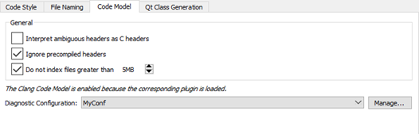
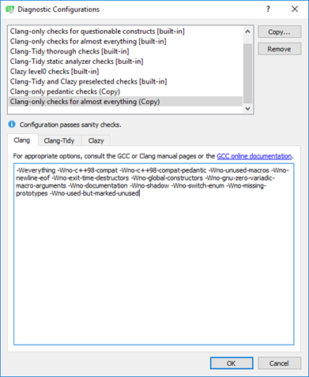
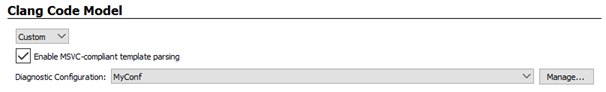

Parsing C++ Files with the Clang Code Model
===========================================

The *code model* is the part of an IDE that understands the language you are using to write your application. It is the framework that allows Qt Creator to provide the following services:

-   [Code completion](https://doc.qt.io/qtcreator/creator-completing-code.html)
-   Syntactic and [semantic highlighting](https://doc.qt.io/qtcreator/creator-highlighting.html)
-   Navigating in the code by using the [locator](https://doc.qt.io/qtcreator/creator-editor-locator.html), [following symbols](https://doc.qt.io/qtcreator/creator-coding-navigating.html#moving-to-symbol-definition-or-declaration), and so on
-   Inspecting code by using the [class browser](https://doc.qt.io/qtcreator/creator-quick-tour.html#browsing-project-contents), the [outline](https://doc.qt.io/qtcreator/creator-quick-tour.html#viewing-qml-types), and so on
-   Diagnostics
-   [Tooltips](https://doc.qt.io/qtcreator/creator-help.html#viewing-function-tooltips)
-   [Finding and renaming symbols](https://doc.qt.io/qtcreator/creator-editor-refactoring.html#finding-symbols)
-   [Refactoring actions](https://doc.qt.io/qtcreator/creator-editor-refactoring.html#applying-refactoring-actions)

Qt Creator comes with a plugin that provides some of these services for C++ on top of [Clang](http://clang.llvm.org/).

About the Clang Code Model
-------------------------------------------------

The Clang project provides libraries for parsing C language family source files. The feedback you get through warning and error markers is the same as a compiler will give you, not an incomplete set or a close approximation, as when using the built-in Qt Creator code model. Clang focuses on detailed information for diagnostics, which is really useful if the code contains typos, for example.

Clang keeps up with the development of the C++ language. At the time of this writing, it supports C++98/03, C++11, C++14, C++17, C89, C99, Objective-C, and Objective-C++.

On the downside, for large projects using Clang as code model is slower than using the built-in code model. Clang does not need to generate object files, but it still needs to parse and analyze the source files. For small projects that only use STL, this is relatively fast. But for larger projects that include several files, processing a single file and all the included files can take a while.

The Clang code model plugin now provides some of the services that were previously provided by the built-in C/C++ code model. Currently, the following services are implemented:

-   Code completion
-   Syntactic and semantic highlighting
-   [Diagnostics](https://doc.qt.io/qtcreator/creator-clang-tools.html)
-   Outline of symbols
-   Tooltips
-   Renaming of local symbols

To use the built-in code model instead, select Help > About Plugins > C++, and deselect the ClangCodeModelcheck box. The changes take effect after you restart Qt Creator.

You can configure Clang diagnostics either globally or separately for:

-   Clang code model (globally or at project level)
-   Clang tools (globally or at project level)

Configuring Clang Code Model
-------------------------------------------------

To configure the Clang code model globally:

1.  Select Tools > Options > C++ > Code Model.

    

2.  To instruct the code model to interpret ambiguous header files as C language files if you develop mainly using C, select the Interpret ambiguous headers as C headers check box.
3.  To process precompiled headers, deselect the Ignore precompiled headers check box.
4.  To avoid out-of-memory crashes caused by indexing huge source files that are typically auto-generated by scripts or code, the size of files to index is limited to 5MB by default. To adjust the limit, edit the value for the Do not index files greater than check box. To index all files, deselect the check box.
5.  Select Manage to specify the Clang checks to perform.

    

Clang Checks
-------------------------------------------------

The predefined configurations perform the following Clang checks:

-   Clang-only pedantic checks uses the `-Wpendantic` option that performs checks as required by strict ISO C and ISO C++.
-   Clang-only checks for questionable constructs combines the `-Wall` and `-Wextra` checks for easily avoidable questionable constructions and some additional issues.
-   Clang-only checks for almost everything uses the `-Weverything` option with negative options to suppress some warnings.

You can edit the predefined configurations to perform particular checks beginning with `-W`. Each of these checks also has a negative version that begins with `-Wno`.

Keep in mind that some options turn on other options. For more information, see [Options to Request or Suppress Warnings](https://gcc.gnu.org/onlinedocs/gcc/Warning-Options.html) or the GCC or Clang manual pages.

Specifying Clang Code Model Settings at Project Level
-------------------------------------------------

You can specify Clang code model settings at project level by switching to Projects mode/sidebar-tab then selecting  Clang Code Model.

In addition to configuring the diagnostics, you can select the Enable MSVC-compliant template parsing check box to parse templates in a MSVC-compliant way. This enables Clang to parse headers for example from Active Template Library (ATL) or Windows Runtime Library (WRL). However, using the relaxed and extended rules means that no highlighting or completion can be provided within template functions.

Using Compilation Databases
--------------------------------------------------------------------------------------------------------------------------------------------------

The [JSON compilation database format](https://clang.llvm.org/docs/JSONCompilationDatabase.html) specifies how to replay single builds independently of the build system.

A *compilation database* is basically a list of files and the compiler flags that are used to compile the files. The database is used to feed the code model with the necessary information for correctly parsing the code when you open a file for editing.

To generate a compilation database from the information that the code model has, select Build > Generate Compilation Database.

You can use the experimental Compilation Database Project Manager to open the files in a compilation database with access to all the editing features provided by the Clang code model.

To enable the plugin, select Help > About Plugins > Build Systems > Compilation Database Project Manager. Then restart Qt Creator to load the plugin.

> ###### License note: We preserve copyright notices in a separate file, read [LICENSE.md](./LICENSE.md) file.
