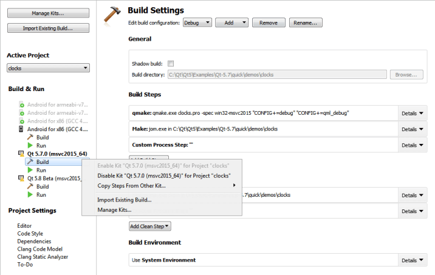

Qt Creator Manual 4.8.1,
see [Title page](title-page.md) for publish details.

Configuring Projects
====================

When you install Qt for a target platform, such as Android or QNX, the build and run settings for the development targets might be set up automatically in Qt Creator.

When you open a project for the first time, the Configure Projects view is displayed to let you select a set of [kits](https://doc.qt.io/qtcreator/creator-glossary.html#glossary-buildandrun-kit) that you want to use to build and run your project. At least one kit must be active for you to be able to build and run the project. For more information about selecting the initial kit, see [Opening Projects](https://doc.qt.io/qtcreator/creator-project-opening.html).

To maintain the list of active kits for a currently open project, switch to the Projects mode/sidebar-tab by holding Ctrl and pressing Five (Ctrl+5).

Activating Kits for a Project
-------------------------------------------------

All kits compatible with your project are listed in the Build & Run section of the sidebar. To activate one or more disabled kits, click them.

The list displays kits that are configured in Tools > Options > Kits. If the kit configuration is not suitable for the project type, warning and error icons are displayed. To view the warning and error messages, move the mouse pointer over the kit name.

To modify kit configuration or to add kits to the list, select Manage Kits. For more information about managing kits, see [Adding Kits](https://doc.qt.io/qtcreator/creator-targets.html).

Each kit consists of a set of values that define one environment, such as a [device](https://doc.qt.io/qtcreator/creator-glossary.html#glossary-device), compiler, and Qt version. For more information, see [Adding Qt Versions](https://doc.qt.io/qtcreator/creator-project-qmake.html), [Adding Compilers](https://doc.qt.io/qtcreator/creator-tool-chains.html), and [Adding Debuggers](https://doc.qt.io/qtcreator/creator-debuggers.html).

To copy the build and run settings for a kit to another kit, select Copy Steps from Other Kit in the context menu.

To deactivate a kit, select Disable Kit for Project in the context menu.

Note: Deactivating a kit removes all custom build and run settings for the kit.

To import an existing build for the project, select Import Existing Build.

Specifying Settings
-------------------------------------------------

To specify build or run settings for a kit, select Build or Run below the kit. For more information, see [Specifying Build Settings](https://doc.qt.io/qtcreator/creator-build-settings.html) and [Specifying Run Settings](https://doc.qt.io/qtcreator/creator-run-settings.html).

In addition, you can modify the following global settings for each project:

-   [Editor](editor-settings.md)
-   [Code Style](https://doc.qt.io/qtcreator/creator-code-style-settings.html)
-   [Dependencies](https://doc.qt.io/qtcreator/creator-build-dependencies.html)
-   [Clang Code Model](clang-codemodel.md)
-   [Clang Tools](https://doc.qt.io/qtcreator/creator-clang-tools.html)
-   [To-Do](https://doc.qt.io/qtcreator/creator-quick-tour.html#to-do-entries) (experimental)

If you have multiple projects open in Qt Creator, select the project to configure in the list of projects.

see also: [Adding Kits >>](targets.md)

> ###### License note: We preserve copyright notices in a separate file, read [LICENSE.md](./LICENSE.md) file.
