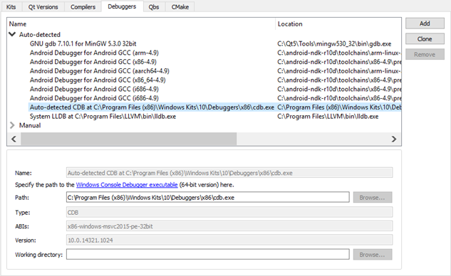

Adding Debuggers
================

The Qt Creator debugger plugin acts as an interface between the Qt Creator core and external native debuggers such as the GNU Symbolic Debugger (GDB), the Microsoft Console Debugger (CDB), a QML/JavaScript debugger, and the debugger of the low level virtual machine (LLVM) project, LLDB.

The debugger plugin automatically selects a suitable native debugger for each [kit](https://doc.qt.io/qtcreator/creator-glossary.html#glossary-buildandrun-kit) from the ones found on your system. To override this choice, select Tools > Options > Kits.

To add debuggers:

1.  Select Tools > Options > Kits > Debuggers > Add.

    

2.  In the Name field, give a descriptive name for the debugger.
3.  In the Path field, specify the path to the debugger binary:
    -   For CDB (Windows only), specify the path to the Windows Console Debugger executable.
    -   For GDB, specify the path to the GDB executable. The executable must be built with Python scripting support enabled.
    -   For LLDB (experimental), specify the path to the LLDB executable.

    Qt Creator attempts to identify the type and version of the debugger and shows them in the Type and Version fields. In addition, Qt Creator shows the ABI version that will be used on embedded devices in the ABIs field.

4.  In the Working directory field, specify the working directory of the application process. If the application is run locally, the working directory defaults to the build directory. If the application is run remotely on a device, the value depends on the shell or the device. Usually, you can leave this field empty.

[<< Adding Compilers](tool-chains.md) ------- [Specifying Build Settings >>](build-settings.md)

> ###### License note: We preserve copyright notices in a separate file, read [LICENSE.md](./LICENSE.md) file.
