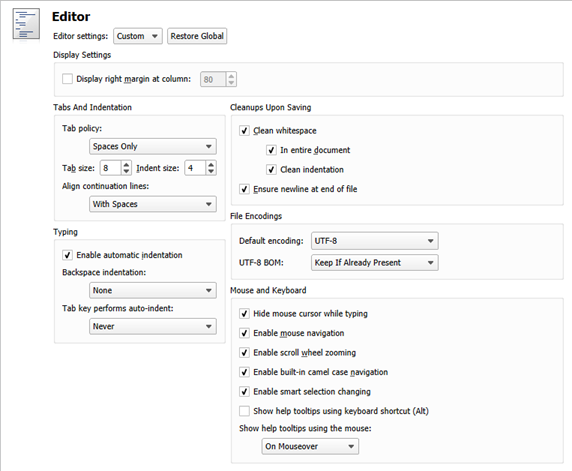

Specifying Editor Settings
==========================

Qt Creator uses the [MIME type](https://doc.qt.io/qtcreator/creator-mime-types.html) of the file to determine which mode and editor to use for opening the file. For example, Qt Creator opens .txt files in Edit mode in the text editor.

You can configure the text editor according to your needs. You can specify editor behavior either globally for all projects or separately for each project. To specify global editor behavior, select Tools > Options > Text Editor > Behavior.

To configure the text editor behavior for the current project:

1.  Swith to Projects mode/sidebar-tab and select `Project Settings` > `Editor`.
2.  In the Editor settings field, select Custom.
3.  Specify text editor settings for the project.

Click Restore Global to revert to the global settings.

For more information about the settings, see:

-   [Indenting Text or Code](https://doc.qt.io/qtcreator/creator-indenting-code.html)
-   [File Encoding](https://doc.qt.io/qtcreator/creator-editor-options-text.html#file-encoding)
-   [Moving to Symbol Definition or Declaration](https://doc.qt.io/qtcreator/creator-coding-navigating.html#moving-to-symbol-definition-or-declaration)
-   [Configuring Fonts](https://doc.qt.io/qtcreator/creator-editor-options-text.html#configuring-fonts)
-   [Highlighting and Folding Blocks](https://doc.qt.io/qtcreator/creator-highlighting.html#highlighting-and-folding-blocks)
-   [Viewing Function Tooltips](https://doc.qt.io/qtcreator/creator-help.html#viewing-function-tooltips)

[<< Specifying Run Settings](run-settings.md) -------

> ###### License note: We preserve copyright notices in a separate file, read [LICENSE.md](./LICENSE.md) file.
