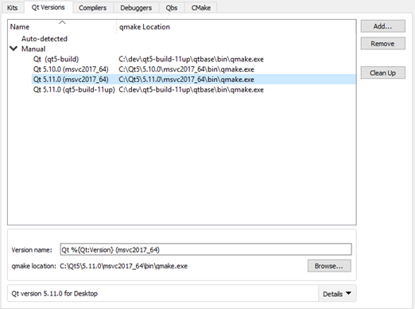

Adding Qt Versions
==================

Qt Creator allows you to have multiple versions of Qt installed on your development PC and use different versions to build your projects. For example, [device](https://doc.qt.io/qtcreator/creator-glossary.html#glossary-device) manufacturers provide special Qt versions for developing applications for their devices.

Qt Creator automatically detects the Qt versions that are registered by your system or by installers. To view detailed information for each Qt version, select it in the list and select Details in the Qt version for section. To add Qt versions, select Tools > Options > Kits > Qt Versions.

You specify the Qt version to use for each [kit](https://doc.qt.io/qtcreator/creator-glossary.html#glossary-buildandrun-kit) for building and running your projects in Tools > Options > Kits.

Setting Up New Qt Versions
-------------------------------------------------

To add a Qt version:

1.  Select Tools > Options > Kits > Qt Versions > Add.
2.  Select the qmake executable for the Qt version that you want to add.
3.  Select the Qt version to view and edit it.

    

4.  In the Version name field, edit the name that Qt Creator suggests for the Qt version.
5.  In the qmake location field, you can change the qmake location.
6.  If the Qt version is for QNX, enter the path to your installed QNX SDK in the QNX SDK field.

Troubleshooting Qt Installations
-------------------------------------------------

If Qt Creator detects problems in the installation of a Qt version, it displays warnings and errors beside the name of the Qt version in the list. Select the Qt version to see more information about the issue and suggestions for fixing it.

To determine whether a particular Qt version is installed correctly, Qt Creator calls `qmake -query` and checks that the directories referenced in the output exist. When Qt Creator complains about the installation of a self-built Qt version, try running `make install` in the build directory to actually install Qt into the configured location. If you installed Qt using the Qt installer, run the Qt maintenance tool to check for updates or to reinstall the Qt version.

Minimum Requirements
-------------------------------------------------

If your build of Qt is incomplete but you still want to use [QMake](http://doc.qt.io/qt-5/qmake-manual.html) as build system, you need to ensure the following minimum requirements to be able to use that setup with Qt Creator.

1.  qmake is an executable that understands the -query command line argument.
2.  The bin and include directories have to exist. Qt Creator fetches these directories by running `qmake -query`.
3.  The mkspecs directory should be complete enough to parse .pro files.

If your Qt version has no libQtCore.so, Qt Creator is unable to detect the ABI.

[<< Adding Kits](targets.md) ------- [Adding Compilers >>](tool-chains.md)

> ###### License note: We preserve copyright notices in a separate file, read [LICENSE.md](./LICENSE.md) file.
