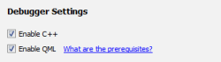
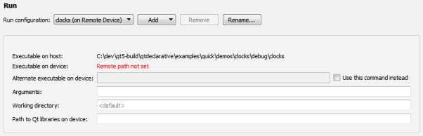
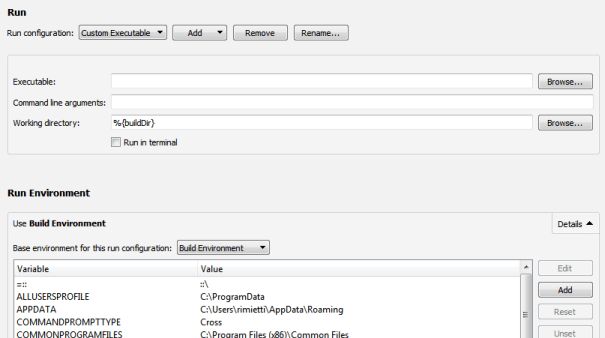
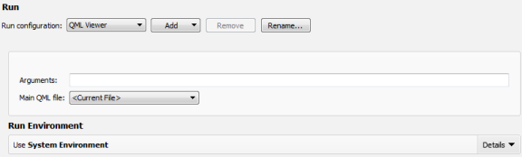

Specifying Run Settings
=======================

The run settings to specify depend on the type of the project and on the [kit](https://doc.qt.io/qtcreator/creator-glossary.html#glossary-buildandrun-kit) that you build and run the project with.

Qt Creator automatically creates run configurations for your project. To view and modify them, switch to `Projects` mode/sidebar-tab and select `Build & Run` > `Run`.

The available run configurations are listed in the Run configuration field. To add run configurations for a project, select Add. To remove the current run configuration, select Remove. To rename the current run configuration, select Rename.

To prevent Qt Creator from automatically creating run configurations, select Tools > Options > Build & Run, and then deselect the "Create suitable run configurations automatically" check box.

The run configurations for qmake projects derive their executable from the parsed .pro files. For more information on how the commands are constructed, see [Starting External Processes](https://doc.qt.io/qtcreator/creator-build-settings.html#starting-external-processes).

Qt Creator automatically adds run configurations for all targets specified in the CMake project file, `CMakeLists.txt`.

Creating Run Configurations for Subprojects
-------------------------------------------------

To prevent Qt Creator from automatically creating run configurations for SUBDIRS projects, specify the following variable in the .pro file of the SUBDIRS project: `CONFIG += qtc_runnable`.

Qt Creator creates run configurations only for subprojects that also have `CONFIG += qtc_runnable` set in their .pro files.

Specifying Run Settings for Desktop Device Types
-------------------------------------------------

You can specify command line arguments to be passed to the executable and the working directory to use. The working directory defaults to the directory of the build result.

For console applications, check the Run in terminal check box. To specify the terminal to use on Linux and macOS, select Tools > Options > Environment > System.

To run with special environment variables set up, select them in the Run Environment section. For more information, see [Selecting the Run Environment](https://doc.qt.io/qtcreator/creator-run-settings.html#selecting-the-run-environment).

When building an application, Qt Creator creates a list of directories where the linker will look for libraries that the application links to. By default, the linked libraries are made visible to the executable that Qt Creator is attempting to run. Usually, you should disable this option only if it causes unwanted side-effects or if you use deployment steps, such as `make install`, and want to make sure that the deployed application will find the libraries also when it is run without Qt Creator.

To disable library linking for the current project, deselect the Add build library search path to PATH check box. To disable library linking for all projects, select Tools > Options > General, and then deselect the Add linker library search paths to run environment check box.

The Use debug version of frameworks (DYLD_IMAGE_SUFFIX=_debug) option (only available on macOS) enables you to debug (for example, step into) linked frameworks, such as the Qt framework itself. You do not need this option for debugging your application code.

You can also create custom executable run configurations where you can set the executable to be run. For more information, see [Specifying a Custom Executable to Run](https://doc.qt.io/qtcreator/creator-run-settings.html#specifying-a-custom-executable-to-run).

Specifying Valgrind Settings
-------------------------------------------------

Qt Creator integrates [Valgrind code analysis tools](https://doc.qt.io/qtcreator/creator-analyze-mode.html) for detecting memory leaks and profiling function execution. You can configure the tools according to your needs.

You can specify Valgrind settings either globally for all projects or separately for each project.

To specify Valgrind settings for the current project:

1.  In the Valgrind Settings section, select Custom.
2.  Specify Valgrind settings for the project.

    

For more information about the settings, see:

-   [Selecting Profiling Options](https://doc.qt.io/qtcreator/creator-cache-profiler.html#selecting-profiling-options)
-   [Selecting Options for Memory Analysis](https://doc.qt.io/qtcreator/creator-analyzer.html#selecting-options-for-memory-analysis)

Click Restore Global to revert to the global settings.

To specify global Valgrind settings, select Tools > Options > Analyzer.

Specifying Debugger Settings
-------------------------------------------------

To select the languages to debug, select the Enable C++ and Enable QML check boxes.

Note: Opening a socket at a well-known port presents a security risk. Anyone on the Internet could connect to the application that you are debugging and execute any JavaScript functions. Therefore, you must make sure that the port is properly protected by a firewall.

For more information about debugging, see [Debugging](https://doc.qt.io/qtcreator/creator-debugging.html).

Specifying Run Settings for Android Devices
-------------------------------------------------

To run and debug an application on an Android device, you must create connections from the development host to the device, as instructed in [Connecting Android Devices](https://doc.qt.io/qtcreator/creator-developing-android.html).

A default set of Android Activity manager (am) start options is applied when starting applications. You can specify additional start options in the Activity manager start options field. However, if the default options conflict with the added options, the application might not start.

For example, to run the application as a particular user, enter the start option `--user 10`, where `10` is the user ID of the user account.

You can specify shell commands to run before the application is started and after it is quit. For example, enter the following commands to unlock the screen and to switch to the user account `10` on the device before running the application:

input keyevent 82
am switch-user 10

Enter the following commands to switch back to the default user, `0`, and to unlock the screen after the application is quit:

am switch-user 0
input keyevent 82

Specifying Run Settings for Linux-Based Devices
-------------------------------------------------

To run and debug an application on a Linux-based device, you must create connections from the development host to the device and add the device configurations to [kits](https://doc.qt.io/qtcreator/creator-glossary.html#glossary-buildandrun-kit). Click Manage Kits to add devices to kits. For more information, see [Connecting Embedded Linux Devices](https://doc.qt.io/qtcreator/creator-developing-generic-linux.html).

When you run the application, Qt Creator copies the files to the connected device.

The run settings display the path to the executable file on the development host and on the device. To specify that another application launches your application, for example, enter the command in the Alternate executable on device field and select the Use this command instead check box.

You can specify command line arguments to pass to your application in the Arguments field.

Specifying Run Settings for QNX Devices
-------------------------------------------------

To run and debug an application on a QNX device, you must create connections from the development PC to the device. Click Manage device configurations to create a connection. For more information, see [Connecting QNX Devices](https://doc.qt.io/qtcreator/creator-developing-qnx.html).

Specifying run settings for QNX Neutrino devices is very similar to [Specifying Run Settings for Linux-Based Devices](https://doc.qt.io/qtcreator/creator-run-settings.html#specifying-run-settings-for-linux-based-devices).

Specifying Run Settings for Embedded Devices
-------------------------------------------------

To run and debug an application on an embedded device (commercial only), you must create connections from the development host to the device and add the device configurations to [kits](https://doc.qt.io/qtcreator/creator-glossary.html#glossary-buildandrun-kit). Select Manage Kits to add devices to kits. For more information, see the [Installation Guide](http://doc.qt.io/QtForDeviceCreation/qtee-installation-guide.html) in the [Qt for Device Creation](http://doc.qt.io/QtForDeviceCreation/index.html) documentation.

The run settings display the path to the executable file on the development host and on the device.

For more information on the deployment steps, see [Deploying Applications to Embedded Linux Devices](https://doc.qt.io/qtcreator/creator-deployment-embedded-linux.html).

Selecting the Run Environment
-------------------------------------------------

Qt Creator automatically selects the environment used for running the application based on the [device](https://doc.qt.io/qtcreator/creator-glossary.html#glossary-device) type. You can edit the environment or select another environment in the Run Environment section.

You can edit existing environment variables or add, reset and unset new variables.

When running on the desktop, the Build Environment is used by default, but you can also use the System Environment without the additions made to the build environment. For more information, see [Build Environment](https://doc.qt.io/qtcreator/creator-build-settings.html#build-environment).

To run in a clean system environment, select Clean Environment.

When running on a mobile device connected to the development host, Qt Creator fetches information about the Device Environment from the device. Usually, it does not make sense to edit the device environment.

To modify the environment variable values for the run environment, select Batch Edit. For more information, see [Batch Editing](https://doc.qt.io/qtcreator/creator-build-settings.html#batch-editing).

Specifying a Custom Executable to Run
-------------------------------------------------

If you use CMake or the generic project type in Qt Creator, or want to run a custom desktop executable, create a Custom Executable run configuration for your project. For example, when working on a library, you can run a test application that links against the library.

Specify the executable to run, command line arguments, working directory, and environment variables to use.

Specifying Run Settings for Qt Quick UI Projects
-------------------------------------------------

You can specify run settings for [kits](https://doc.qt.io/qtcreator/creator-glossary.html#glossary-buildandrun-kit) with Desktop device type:

-   In the Arguments field, you can specify command line arguments to be passed to the executable.
-   In the Main QML file, select the file that Qt QML Viewer will be started with.

[<< Specifying Build Settings](build-settings.md) ------- [Specifying Editor Settings >>](editor-settings.md)

> ###### License note: We preserve copyright notices in a separate file, read [LICENSE.md](./LICENSE.md) file.
