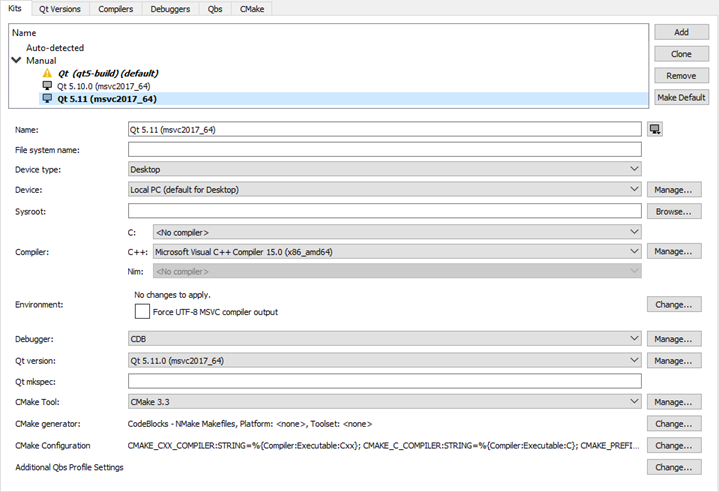
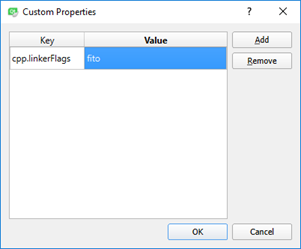

# Adding Kits

Qt Creator groups settings used for building and running projects as kits to make cross-platform and cross-configuration development easier. Each kit consists of a set of values that define one environment, such as a [device](https://doc.qt.io/qtcreator/creator-glossary.html#glossary-device), compiler, Qt version, and debugger command to use, and some metadata, such as an icon and a name for the kit. Once you have defined kits, you can select them to build and run projects.

Qt Creator supports development for the desktop and for the following types of devices:

-   Android Device
-   Bare Metal Device
-   Generic Linux Device
-   iOS Device
-   iOS Simulator
-   QNX Device

To add kits:

1.  Select Tools > Options > Kits > Add.

    

    To clone the selected kit, select Clone.

2.  In the Name column, enter a name for the kit.
3.  Select the  button to select an image to use as an icon for the kit.
4.  In the File system name field, enter a name for the kit to use as a part of directory names. This value is used for the *CurrentKit:FileSystemName* variable, which determines the name of the shadow build directory, for example.
5.  In the Device type field, select the type of the device.

    Double-click the icon next to the field to select the image that is displayed in the kit selector for this kit. You can use any image in a supported file format (for example, PNG). The image is scaled to the size 64x64 pixels. For example, using the compiler logo as an icon allows you to easily see, which compiler is used to build the project for the selected kit.

6.  In the Device field, select a device.
7.  In the Sysroot field, specify the directory where the device image is located. If you are not cross-compiling, leave this field empty.
8.  In the Compiler field, select the C or C++ compiler that you use to build the project. You can add compilers to the list if they are installed on the development PC, but were not detected automatically. For more information, see [Adding Compilers](https://doc.qt.io/qtcreator/creator-tool-chains.html). This setting is used to tell the code model which compiler is used. If your project type and build tool support it, Qt Creator also tells the build tool to use this compiler for building the project.
9.  In the Environment field, select Change to modify environment variable values for build environments in the Edit Environment Changes dialog. For more information about how to add and remove variable values, see [Batch Editing](https://doc.qt.io/qtcreator/creator-build-settings.html#batch-editing).
10. Select the Force UTF-8 MSVC compiler output check box to either switch the language of MSVC to English or to keep the language setting and just force UTF-8 output, depending on the MSVC compiler used.
11. In the Debugger field, select the debugger to debug the project on the target platform. Qt Creator automatically detects available debuggers and displays a suitable debugger in the field. You can add debuggers to the list. For more information, see [Adding Debuggers](https://doc.qt.io/qtcreator/creator-debuggers.html).

    For Android kits, the Android GDB server field will display the path to GDB server executable.

12. In the Qt version field, select the Qt version to use for building the project. You can add Qt versions to the list if they are installed on the development PC, but were not detected automatically. For more information, see [Adding Qt Versions](https://doc.qt.io/qtcreator/creator-project-qmake.html).

    Qt Creator checks the directories listed in the `PATH` environment variable for the qmake executable. If a qmake executable is found, it is referred to as Qt in PATH and selected as the Qt version to use for the Desktop kit that is created by default.

13. In the Qt mkspec field, specify the name of the mkspec configuration that should be used by qmake. If you leave this field empty, the default mkspec of the selected Qt version is used.
14. In the CMake Tool field, select the CMake tool to use for building the project. Select Manage to add installed CMake tools to the list. For more information, see [Adding CMake Tools](https://doc.qt.io/qtcreator/creator-project-cmake.html#adding-cmake-tools).
15. In the CMake generator field, select Change to edit the CMake Generator to use for producing project files. Only the generators with names beginning with the string CodeBlocks produce all the necessary data for the Qt Creator code model. Qt Creator displays a warning if you select a generator that is not supported.
16. In the CMake configuration field, select Change to edit the variables of the CMake configuration for the kit.
17. In the Additional Qbs profile settings field, select Change to add settings to Qbs build profiles. For more information, see [Editing Qbs Profiles](https://doc.qt.io/qtcreator/creator-targets.html#editing-qbs-profiles).

Qt Creator uses the *default kit* if it does not have enough information to choose the kit to use. To set the selected kit as the default kit, select Make Default.

Editing Qbs Profiles
-------------------------------------------------

To view the Qbs profile associated with the kit, select Tools > Options > Kits > Qbs.

You can add keys and values to the profile or remove them from it, as well as modify existing values. For a list of available keys and values, see [List of Modules](http://doc.qt.io/qbs/list-of-modules.html) in the Qbs Manual.

To edit the Qbs profile associated with the kit:

1.  Select Change next to the Additional Qbs Profile Settings field.

    

2.  Select Add.
3.  In the Key column, spefify the key to add or modify as: `<module_name>.<property_name>`.
4.  In the Value column, specify a value as a JSON literal.
5.  Click OK.

To modify an existing value, double-click it in the Value field.

To remove the selected property, select Remove.

[<< Configuring Projects](configuring-projects.md) ------- [Adding Qt Versions >>](project-qmake.md)

> ###### License note: We preserve copyright notices in a separate file, read [LICENSE.md](./LICENSE.md) file.
