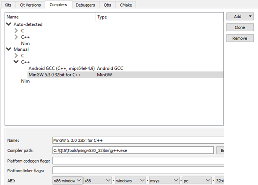
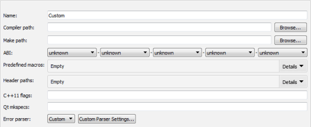
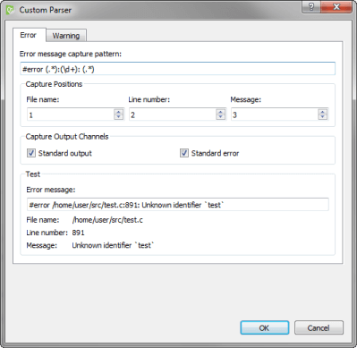

Adding Compilers
================

Qt is supported on a variety of 32-bit and 64-bit platforms, and can usually be built on each platform with GCC, a vendor-supplied compiler, or a third party compiler. In Qt Creator, a [kit](https://doc.qt.io/qtcreator/creator-glossary.html#glossary-buildandrun-kit) specifies the compiler and other necessary tools for building an application for and running it on a particular platform.

Qt Creator automatically detects the compilers that are registered by your system or by an installer. You can add compilers to build applications by using other compilers or by using additional versions of the automatically detected compilers:

-   GNU Compiler Collection (GCC) is a compiler for Linux and macOS.
-   [MinGW](https://mingw-w64.org/) (Minimalist GNU for Windows) is a native software port of GCC and GNU Binutils for use in the development of native Microsoft Windows applications on Windows. [MinGW](https://mingw-w64.org/) is distributed together with Qt Creator and Qt installers for Windows.
-   Linux ICC (Intel C++ Compiler) is a group of C and C++ compilers for Linux.
-   Clang is a C, C++, Objective C, and Objective C++ front-end for the LLVM compiler for Windows, Linux, and macOS.
-   Nim is the Nim Compiler for Windows, Linux, and macOS.
-   QCC is the interface for compiling C++ applications for QNX.

To build an application using GCC, [MinGW](https://mingw-w64.org/), Clang, or QCC, specify the path to the directory where the compiler is located and select the application binary interface (ABI) version from the list of available versions. You can also create a custom ABI definition. For QCC, also specify the path to the QNX Software Development Platform (SDP).

You specify the compiler to use for each kit in Tools > Options > Kits.

To add C or C++ compilers:

1.  Select Tools > Options > Kits > Compilers > Add, then select a compiler in the list, and then select C or C++ to add a C or C++ compiler.

    

    To clone the selected compiler, select Clone.

2.  In the Name field, enter a name for the compiler to identify it in Qt Creator.
3.  In the Compiler path field, enter the path to the directory where the compiler is located.
4.  In the Platform codegen flags field, check the flags passed to the compiler that specify the architecture on the target platform.
5.  In the Platform linker flags field, check the flags passed to the linker that specify the architecture on the target platform. The linker flags are used only when building with Qbs.

    The other settings to specify depend on the compiler.

6.  In the ABI field, provide an identification for the target architecture. This is used to warn about ABI mismatches within the kits.

Adding Nim Compilers
-------------------------------------------------

To build an application using the Nim Compiler, select Tools > Options > Kits > Compilers > Add > Nim, and specify the path to the directory where the compiler is located.

Adding Custom Compilers
-------------------------------------------------

To add a compiler that is not listed above or a remote compiler, use the Custom option and specify the paths to the directories where the compiler and make tool are located and options for the compiler.



To add other compilers:

1.  Select Tools > Options > Kits > Compilers > Add > Custom > C or C++.
2.  In the Name field, enter a name for the compiler.
3.  In the Compiler path field, enter the path to the directory where the compiler is located.
4.  In the Make path field, enter the path to the directory where the make tool is located.
5.  In the ABI field, specify the ABI version.
6.  In the Predefined macros field, specify the macros that the compiler enables by default. Specify each macro on a separate line, in the following format: MACRO[=value].
7.  In the Header paths field, specify the paths to directories that the compiler checks for headers. Specify each path on a separate line.
8.  In the C++11 flags field, specify the flags that turn on C++11 support in the compiler.
9.  In the Qt mkspecs field, specify the path to the directory where mkspecs are located. Usually, the path is specified relative to the Qt mkspecs directory.
10. In the Error parser field, select the error parser to use. Select Custom, and then select Customer Parser Settings to specify settings for a custom parser:

    

    The custom error parser enables you to capture errors and warnings separately. You can configure the error parser in the Error tab and the warning parser in the Warning tab:

    1.  In the Error message capture pattern field, specify a regular expression to define what is an error. The custom parser matches the compile output line by line against the regular expression and displays errors in the Issues output pane. Create regular expression groups that contain the file name, line number and error message.
    2.  In the Capture Positions field, map the regular expression groups to File name, Line number, and Message.
    3.  In the Capture Output Channels field, specify whether messages from standard output, standard error, or both channels should be captured.
    4.  In the Test group, you can test how the message that you enter in the Error message field is matched when using the current settings.

Troubleshooting MinGW Compilation Errors
-------------------------------------------------

If error messages displayed in the Compile Output pane contain paths where slashes are missing (for example, `C:QtSDK`), check your PATH variable. At the command line, enter the following commands:
```
where sh.exe
where make.exe
where mingw32-make.exe
```
If these commands show paths, they have been added to the global PATH variable during the installation of a tool chain based on Cygwin or [MinGW](https://mingw-w64.org/), even though this is against Windows conventions.

To keep working with the third-party tool chain, create a new shell link that adds the required paths (as Visual Studio and Qt do). The shell link must point to cmd.exe, as illustrated by the following example:

`C:\Windows\System32\cmd.exe /K C:\path_to\myenv.bat`

where the /K parameter carries out the command specified in the bat file.

Create the myenv.bat file at *path_to*, which should be in a convenient location. In the file, specify the paths to the tool chains. For example,

`set PATH=C:\path1;C:\path2;%PATH%`

where *path1* and *path2* are paths to the tool chains.

Finally, remove the paths from the global PATH, reboot the computer, and run the `where` commands again to verify that the global PATH is now clean.

You can use the shell link to run the tools in the third-party tool chains.

[<< Adding Qt Versions](project-qmake.md) -------- [Adding Debuggers >>](debuggers.md)


> ###### License note: We preserve copyright notices in a separate file, read [LICENSE.md](./LICENSE.md) file.
